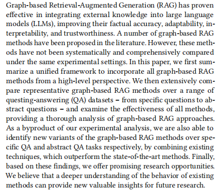
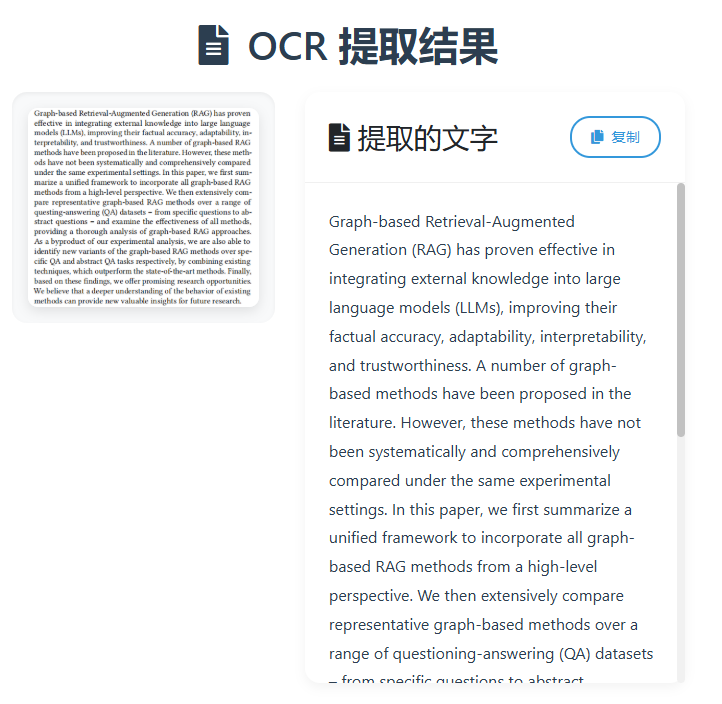

# Gemma-3 OCR 文字识别系统

基于 Gemma-3 Vision 模型的 OCR 文字识别系统，可以快速准确地从图片中提取文字内容。

## 功能特点

- 支持图片上传和预览
- 使用 Gemma-3 Vision 模型进行文字识别
- 美观的用户界面
- 实时显示识别结果
- 支持多种图片格式

## 技术栈

- Python 3.x
- Flask
- Ollama (gemma3:12b)
- Bootstrap 4
- HTML5/CSS3

## 安装说明

1. 克隆仓库：
```bash
git clone https://github.com/HangChi/Gemma3_OCR.git
cd Gemma3_OCR
```

2. 安装依赖：
```bash
pip install -r requirements.txt
```

3. 安装 Ollama 并下载 Gemma-3 模型：
```bash
# 安装 Ollama
curl https://ollama.ai/install.sh | sh

# 下载 Gemma-3 模型
ollama pull gemma3:12b
```

4. 运行应用：
```bash
python app.py
```

5. 访问应用：
打开浏览器访问 `http://localhost:5000`

## 使用说明

1. 点击"选择文件"按钮上传图片
2. 预览图片内容
3. 点击"提取文字"按钮
4. 等待系统处理并显示识别结果

## 效果展示

原图：



识别结果：



```
Graph-based Retrieval-Augmented Generation (RAG) has proven effective in integrating external knowledge into large language models (LLMs), improving their factual accuracy, adaptability, interpretability, and trustworthiness. A number of graph-based methods have been proposed in the literature. However, these methods have not been systematically and comprehensively compared under the same experimental settings. In this paper, we first summarize a unified framework to incorporate all graph-based RAG methods from a high-level perspective. We then extensively compare representative graph-based methods over a range of questioning-answering (QA) datasets – from specific questions to abstract questions – and examine the effectiveness of all methods, providing a thorough analysis of graph-based RAG approaches. As a byproduct of our experimental analysis, we are also able to identify new variants of the graph-based methods over a range of specific QA and abstract questions respectively, by combining existing techniques, which outperform the state-of-the-art methods. Finally, based on these findings, we offer promising research opportunities. We believe that a deeper understanding of the behavior of existing methods can provide new valuable insights for future research.
```

